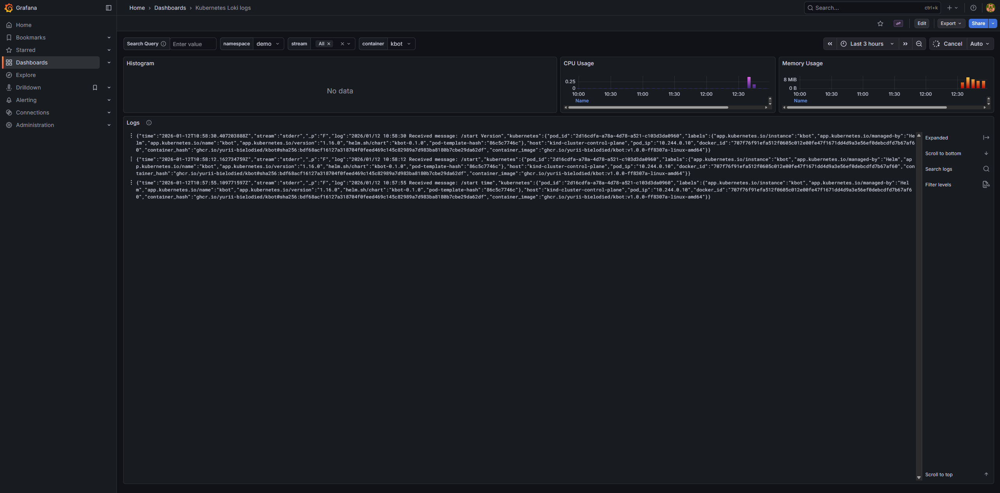

# Monitoring Stack для Kubernetes (Senior Level)

Моніторинговий стек розгорнутий у dev-середовищі Kubernetes за допомогою GitOps (Flux CD) з OpenTelemetry Operator.

## 🎯 Рівень виконання: 10 балів (Senior)

| Критерій                       | Статус                                   |
| ------------------------------ | ---------------------------------------- |
| Kubernetes dev-середовище      | ✅ Kind кластер                          |
| Flux GitOps                    | ✅ Повна автоматизація                   |
| **OTEL розгорнуто оператором** | ✅ `OpenTelemetryCollector` CRD          |
| Fluent-Bit збирає логи         | ✅ Всі ноди та контейнери                |
| Проект інструментовано         | ✅ ServiceMonitor + Auto-instrumentation |

---

## 📦 Компоненти стеку

| Компонент                   | Опис                         | Розгортання                |
| --------------------------- | ---------------------------- | -------------------------- |
| **Prometheus**              | Збір та зберігання метрик    | kube-prometheus-stack Helm |
| **Grafana**                 | Візуалізація та дашборди     | kube-prometheus-stack Helm |
| **Loki**                    | Агрегація логів              | Grafana Loki Helm          |
| **Fluent-Bit**              | Збір логів з нод             | Fluent Helm                |
| **OpenTelemetry Operator**  | Управління OTEL Collectors   | OT Operator Helm           |
| **OpenTelemetry Collector** | Traces/Metrics/Logs pipeline | **Operator CRD** ⭐        |
| **Jaeger**                  | Distributed tracing UI       | Jaegertracing Helm         |
| **cert-manager**            | TLS сертифікати для webhooks | Jetstack Helm              |

---

## 🏗️ Архітектура

```
┌─────────────────────────────────────────────────────────────────────────┐
│                        Kind Kubernetes Cluster                           │
├─────────────────────────────────────────────────────────────────────────┤
│                                                                          │
│  ┌────────────────────────────────────────────────────────────────┐     │
│  │                    OpenTelemetry Operator                       │     │
│  │  Manages OpenTelemetryCollector CRD + Auto-Instrumentation     │     │
│  └────────────────────────────────────────────────────────────────┘     │
│                              │                                           │
│                              ▼                                           │
│  ┌──────────────┐    ┌──────────────────┐    ┌──────────────┐          │
│  │   kbot app   │───▶│ OpenTelemetry    │───▶│   Jaeger     │          │
│  │   (demo ns)  │    │ Collector (CRD)  │    │  (traces)    │          │
│  │              │    │                  │    └──────────────┘          │
│  │ [Instrumented]    │  receivers:      │                               │
│  │ - /metrics   │    │  - otlp          │    ┌──────────────┐          │
│  │ - traces     │    │  - prometheus    │───▶│  Prometheus  │          │
│  └──────────────┘    │                  │    │  (metrics)   │          │
│         │            │  exporters:      │    └──────────────┘          │
│         │            │  - jaeger        │           │                   │
│         ▼            │  - prometheus    │           │                   │
│  ┌──────────────┐    │  - loki          │           ▼                   │
│  │  Fluent-Bit  │───▶└──────────────────┘    ┌──────────────┐          │
│  │   (logs)     │            │               │   Grafana    │          │
│  └──────────────┘            │               │ (dashboards) │          │
│         │                    ▼               └──────────────┘          │
│         │            ┌──────────────┐              ▲                    │
│         └───────────▶│    Loki      │──────────────┘                    │
│                      │(log storage) │                                   │
│                      └──────────────┘                                   │
└─────────────────────────────────────────────────────────────────────────┘
```

---

## 🚀 Швидкий старт

### Передумови

- Docker
- Terraform >= 1.0
- kubectl
- GitHub токен з правами на створення deploy keys

### Розгортання

```bash
# 1. Клонуйте репозиторій
git clone <repository-url>
cd monitoring-repo

# 2. Налаштуйте змінні
cp terraform.tfvars.example terraform.tfvars
# Відредагуйте: GITHUB_OWNER, GITHUB_TOKEN, FLUX_GITHUB_REPO, TELE_TOKEN

# 3. Розгорніть
terraform init
terraform apply

# 4. Встановіть kubeconfig
export KUBECONFIG=$(pwd)/kind-cluster-config

# 5. Перевірте статус
flux get all -A
kubectl get pods -n monitoring -w
```

---

## 📊 Доступ до Grafana

```bash
kubectl port-forward -n monitoring svc/kube-prometheus-stack-grafana 8080:80
```

**URL:** http://localhost:8080  
**Username:** admin  
**Password:** grafana

### Налаштовані Data Sources

| Джерело    | URL                                                                  |
| ---------- | -------------------------------------------------------------------- |
| Prometheus | `http://kube-prometheus-stack-prometheus.monitoring:9090/prometheus` |
| Loki       | `http://loki.monitoring:3100`                                        |
| Jaeger     | `http://jaeger-query.monitoring:16686`                               |

---

## 📸 Демо: Grafana Loki Dashboard



На скріншоті показано:

- Фільтрація логів за namespace `demo` та контейнером `kbot`
- Histogram логів з часовою шкалою
- Графіки CPU та Memory Usage
- Детальний перегляд логів у JSON форматі

---

## ⭐ OpenTelemetry Operator (Senior Level)

### Чому Operator, а не Helm Chart?

| Helm Chart                   | Operator                                |
| ---------------------------- | --------------------------------------- |
| Статичне розгортання         | Декларативне управління через CRD       |
| Ручне оновлення конфігурації | Автоматична реконсіляція                |
| Немає auto-instrumentation   | Підтримка `Instrumentation` CRD         |
| Один collector               | Можливість керувати багатьма collectors |

### OpenTelemetryCollector CRD

```yaml
apiVersion: opentelemetry.io/v1beta1
kind: OpenTelemetryCollector
metadata:
  name: otel-collector
  namespace: monitoring
spec:
  mode: deployment
  replicas: 1
  config:
    receivers:
      otlp:
        protocols:
          grpc:
            endpoint: 0.0.0.0:4317
          http:
            endpoint: 0.0.0.0:4318
      prometheus:
        config:
          scrape_configs:
            - job_name: "kbot-metrics"
              kubernetes_sd_configs:
                - role: pod
                  namespaces:
                    names: [demo]

    processors:
      k8sattributes:
        extract:
          metadata: [k8s.namespace.name, k8s.pod.name]

    exporters:
      otlp/jaeger:
        endpoint: jaeger-collector.monitoring:4317
      prometheus:
        endpoint: 0.0.0.0:8889
      otlphttp/loki:
        endpoint: http://loki.monitoring:3100/otlp

    service:
      pipelines:
        traces:
          receivers: [otlp]
          exporters: [otlp/jaeger]
        metrics:
          receivers: [otlp, prometheus]
          exporters: [prometheus]
        logs:
          receivers: [otlp]
          exporters: [otlphttp/loki]
```

---

## 📈 Інструментація проекту kbot

### Варіант 1: Prometheus Metrics Endpoint (Рекомендовано)

Додайте до коду kbot (Go):

```go
package main

import (
    "net/http"

    "github.com/prometheus/client_golang/prometheus"
    "github.com/prometheus/client_golang/prometheus/promauto"
    "github.com/prometheus/client_golang/prometheus/promhttp"
)

var (
    // Лічильник оброблених повідомлень
    messagesProcessed = promauto.NewCounterVec(
        prometheus.CounterOpts{
            Name: "kbot_messages_processed_total",
            Help: "Total number of messages processed",
        },
        []string{"command", "status"},
    )

    // Гістограма часу обробки
    messageLatency = promauto.NewHistogramVec(
        prometheus.HistogramOpts{
            Name:    "kbot_message_duration_seconds",
            Help:    "Message processing duration",
            Buckets: prometheus.DefBuckets,
        },
        []string{"command"},
    )

    // Gauge активних з'єднань
    activeConnections = promauto.NewGauge(
        prometheus.GaugeOpts{
            Name: "kbot_active_connections",
            Help: "Number of active connections",
        },
    )
)

func main() {
    // Запуск metrics сервера
    go func() {
        http.Handle("/metrics", promhttp.Handler())
        http.ListenAndServe(":8080", nil)
    }()

    // ... решта коду kbot
}

// Приклад використання в обробнику повідомлень
func handleMessage(command string) {
    timer := prometheus.NewTimer(messageLatency.WithLabelValues(command))
    defer timer.ObserveDuration()

    // ... обробка

    messagesProcessed.WithLabelValues(command, "success").Inc()
}
```

### Варіант 2: OpenTelemetry Auto-Instrumentation

Додайте анотацію до Deployment kbot:

```yaml
apiVersion: apps/v1
kind: Deployment
metadata:
  name: kbot
  namespace: demo
spec:
  template:
    metadata:
      annotations:
        # Активує auto-instrumentation
        instrumentation.opentelemetry.io/inject-go: "true"
        # Prometheus scraping
        prometheus.io/scrape: "true"
        prometheus.io/port: "8080"
        prometheus.io/path: "/metrics"
```

### ServiceMonitor для kbot

Вже створено у `flux-repo/cluster/demo/kbot-monitoring.yaml`:

```yaml
apiVersion: monitoring.coreos.com/v1
kind: ServiceMonitor
metadata:
  name: kbot
  namespace: demo
spec:
  selector:
    matchLabels:
      app.kubernetes.io/name: kbot
  endpoints:
    - port: metrics
      interval: 30s
      path: /metrics
```

---

## 📁 Структура проєкту

```
monitoring-repo/
├── main.tf
├── variables.tf
├── terraform.tf
├── modules/
│   ├── kind-cluster/
│   └── fluxcd-flux-bootstrap/
└── flux-repo/
    └── cluster/
        ├── namespaces/
        │   └── namespaces.yaml        # monitoring, cert-manager
        ├── monitoring/
        │   ├── helm-repos.yaml        # prometheus, grafana, otel, jetstack
        │   ├── cert-manager.yaml      # TLS для webhooks
        │   ├── kube-prometheus-stack.yaml
        │   ├── loki.yaml
        │   ├── fluent-bit.yaml
        │   ├── jaeger.yaml
        │   ├── otel-operator.yaml     # ⭐ OTEL Operator
        │   └── otel-collector.yaml    # ⭐ OpenTelemetryCollector CRD
        └── demo/
            ├── kbot-gr.yaml
            ├── kbot-hr.yaml
            └── kbot-monitoring.yaml   # ServiceMonitor + Instrumentation
```

---

## 🔧 Конфігурація Fluent-Bit

Збирає логи з **усіх контейнерів та нод** кластеру:

```yaml
inputs: |
  [INPUT]
      Name tail
      Path /var/log/containers/*.log    # Всі контейнери
      multiline.parser docker, cri
      Tag kube.*
      Mem_Buf_Limit 5MB
      Skip_Long_Lines On

filters: |
  [FILTER]
      Name kubernetes
      Match kube.*
      Merge_Log On
      K8S-Logging.Parser On

outputs: |
  [OUTPUT]
      Name loki
      Match kube.*
      Host loki.monitoring.svc.cluster.local
      Port 3100
      Labels job=fluentbit,namespace=$kubernetes['namespace_name'],
             pod=$kubernetes['pod_name'],container=$kubernetes['container_name']
```

---

## 🔍 Корисні команди

```bash
# Статус Flux
flux get all -A

# Статус OTEL Operator
kubectl get opentelemetrycollectors -n monitoring

# Логи OTEL Collector
kubectl logs -n monitoring -l app.kubernetes.io/name=otel-collector-collector

# Перевірка Instrumentation
kubectl get instrumentation -n demo

# Port-forward сервіси
kubectl port-forward -n monitoring svc/kube-prometheus-stack-grafana 8080:80
kubectl port-forward -n monitoring svc/jaeger-query 16686:16686
kubectl port-forward -n monitoring svc/kube-prometheus-stack-prometheus 9090:9090
```

---

## 🧹 Очищення

```bash
terraform destroy
```

---

## 📚 Посилання

- [OpenTelemetry Operator](https://opentelemetry.io/docs/kubernetes/operator/)
- [OpenTelemetryCollector CRD](https://github.com/open-telemetry/opentelemetry-operator/blob/main/docs/api.md)
- [Go Instrumentation](https://opentelemetry.io/docs/languages/go/)
- [Prometheus Client Go](https://github.com/prometheus/client_golang)
- [Flux CD](https://fluxcd.io/docs/)
