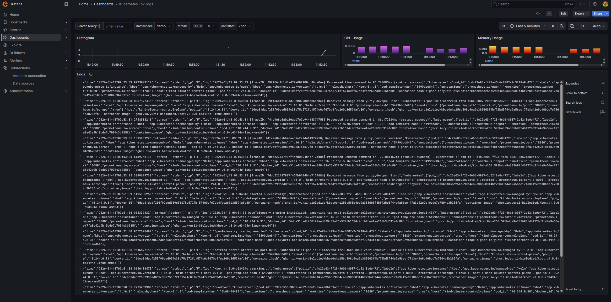
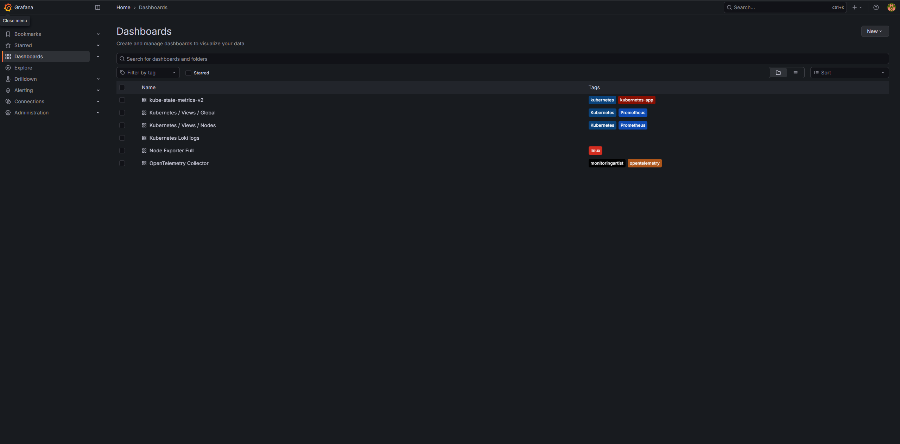
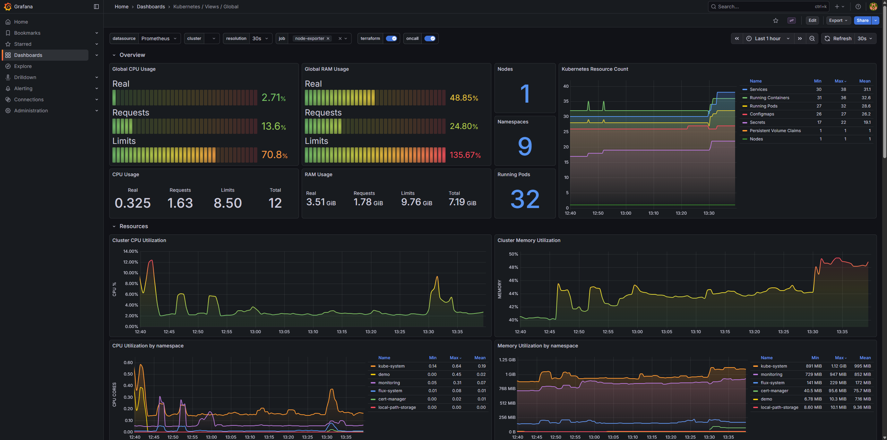

# Monitoring Stack для Kubernetes (Principal Level)

Моніторинговий стек розгорнутий у dev-середовищі Kubernetes за допомогою GitOps (Flux CD) з OpenTelemetry Operator та наскрізним TraceID.

## 🎯 Рівень виконання: 20 балів (Principal)

| Критерій                   | Статус                                        |
| -------------------------- | --------------------------------------------- |
| Kubernetes dev-середовище  | ✅ Kind кластер                               |
| Flux GitOps                | ✅ Повна автоматизація                        |
| OTEL розгорнуто оператором | ✅ `OpenTelemetryCollector` CRD               |
| Fluent-Bit збирає логи     | ✅ Всі ноди та контейнери                     |
| Проект інструментовано     | ✅ Prometheus metrics                         |
| **Наскрізний TraceID**     | ✅ **OpenTelemetry SDK + кореляція з логами** |

---

## 📦 Компоненти стеку

| Компонент                   | Опис                         | Розгортання                |
| --------------------------- | ---------------------------- | -------------------------- |
| **Prometheus**              | Збір та зберігання метрик    | kube-prometheus-stack Helm |
| **Grafana**                 | Візуалізація та дашборди     | kube-prometheus-stack Helm |
| **Loki**                    | Агрегація логів              | Grafana Loki Helm          |
| **Fluent-Bit**              | Збір логів з нод             | Fluent Helm                |
| **OpenTelemetry Operator**  | Управління OTEL Collectors   | OT Operator Helm           |
| **OpenTelemetry Collector** | Traces/Metrics/Logs pipeline | **Operator CRD** ⭐        |
| **Jaeger**                  | Distributed tracing UI       | Jaegertracing Helm         |
| **cert-manager**            | TLS сертифікати для webhooks | Jetstack Helm              |

---

## 🏗️ Архітектура з наскрізним TraceID

```
┌─────────────────────────────────────────────────────────────────────────────┐
│                        Kind Kubernetes Cluster                               │
├─────────────────────────────────────────────────────────────────────────────┤
│                                                                              │
│  ┌────────────────────────────────────────────────────────────────────┐     │
│  │                    OpenTelemetry Operator                           │     │
│  │  Manages OpenTelemetryCollector CRD + Auto-Instrumentation          │     │
│  └────────────────────────────────────────────────────────────────────┘     │
│                                                                              │
│  ┌─────────────────────────────────────────────────────────────────────┐    │
│  │                         kbot (demo ns)                               │    │
│  │  ┌─────────────────────────────────────────────────────────────┐    │    │
│  │  │  OpenTelemetry SDK                                          │    │    │
│  │  │  - Traces з TraceID                                         │    │    │
│  │  │  - Spans для кожної операції                                │    │    │
│  │  │  - TraceID в логах: [TraceID: abc123...]                   │    │    │
│  │  └─────────────────────────────────────────────────────────────┘    │    │
│  │  ┌─────────────────────────────────────────────────────────────┐    │    │
│  │  │  Prometheus Client                                          │    │    │
│  │  │  - /metrics endpoint                                        │    │    │
│  │  │  - kbot_messages_total                                      │    │    │
│  │  │  - kbot_message_processing_duration_seconds                 │    │    │
│  │  └─────────────────────────────────────────────────────────────┘    │    │
│  └─────────────────────────────────────────────────────────────────────┘    │
│         │                    │                      │                        │
│         │ OTLP (traces)      │ /metrics             │ stdout logs            │
│         ▼                    ▼                      ▼                        │
│  ┌──────────────┐    ┌──────────────┐    ┌──────────────┐                   │
│  │    OTEL      │    │  Prometheus  │    │  Fluent-Bit  │                   │
│  │  Collector   │    │              │    │              │                   │
│  └──────────────┘    └──────────────┘    └──────────────┘                   │
│         │                    │                      │                        │
│         ▼                    │                      ▼                        │
│  ┌──────────────┐            │            ┌──────────────┐                   │
│  │   Jaeger     │            │            │    Loki      │                   │
│  │  (traces)    │            │            │   (logs)     │                   │
│  └──────────────┘            │            └──────────────┘                   │
│         │                    │                      │                        │
│         └────────────────────┼──────────────────────┘                        │
│                              ▼                                               │
│                      ┌──────────────┐                                        │
│                      │   Grafana    │                                        │
│                      │              │                                        │
│                      │ Traces ←→ Logs correlation                           │
│                      │ via TraceID                                          │
│                      └──────────────┘                                        │
└─────────────────────────────────────────────────────────────────────────────┘
```

---

## 🔗 Наскрізний TraceID (Principal Level)

### Як це працює

1. **kbot** створює span при отриманні повідомлення
2. **TraceID** генерується автоматично OpenTelemetry SDK
3. **TraceID** додається до логів: `[TraceID: abc123...] Received message...`
4. **Traces** експортуються до OTEL Collector → Jaeger
5. **Logs** збираються Fluent-Bit → Loki
6. **Grafana** корелює traces та logs за TraceID

### Приклад логів з TraceID

```
[TraceID: 4bf92f3577b34da6a3ce929d0e0e4736] Received message from user123: /kbot hello
[TraceID: 4bf92f3577b34da6a3ce929d0e0e4736] Processed hello command in 5ms (status: success)
```

### Кореляція в Grafana

В Loki можна знайти всі логи за TraceID:

```logql
{namespace="demo"} |= "4bf92f3577b34da6a3ce929d0e0e4736"
```

В Jaeger можна знайти trace та побачити всі spans.

---

## 🚀 Швидкий старт

### Передумови

- Docker
- Terraform >= 1.0
- kubectl
- GitHub токен з правами на створення deploy keys

### Розгортання

```bash
# 1. Клонуйте репозиторій
git clone <repository-url>
cd monitoring-repo

# 2. Налаштуйте змінні
cp terraform.tfvars.example terraform.tfvars
# Відредагуйте: GITHUB_OWNER, GITHUB_TOKEN, FLUX_GITHUB_REPO, TELE_TOKEN

# 3. Розгорніть
terraform init
terraform apply

# 4. Встановіть kubeconfig
export KUBECONFIG=$(pwd)/kind-cluster-config

# 5. Перевірте статус
flux get all -A
kubectl get pods -n monitoring -w
```

---

## 📊 Доступ до Grafana

```bash
kubectl port-forward -n monitoring svc/kube-prometheus-stack-grafana 8080:80
```

**URL:** http://localhost:8080  
**Username:** admin  
**Password:** grafana

### Налаштовані Data Sources

| Джерело    | URL                                                                  | Призначення |
| ---------- | -------------------------------------------------------------------- | ----------- |
| Prometheus | `http://kube-prometheus-stack-prometheus.monitoring:9090/prometheus` | Метрики     |
| Loki       | `http://loki.monitoring:3100`                                        | Логи        |
| Jaeger     | `http://jaeger-query.monitoring:16686`                               | Traces      |

---

## 📸 Демо: Grafana Loki Dashboard

На скріншоті показано:

- Фільтрація логів за namespace `demo` та контейнером `kbot`
- Histogram логів з часовою шкалою
- Графіки CPU та Memory Usage
- Детальний перегляд логів у JSON форматі



## Grafana Dashboards

Також доступні інші дашборди



На скріншоті показано:

- Графіки CPU та Memory Usage
- CPU Requests & Limits
- Cluster Utilization



---

## 📈 Інструментація kbot

### Prometheus Metrics

kbot експортує наступні метрики на `/metrics`:

| Метрика                                    | Тип       | Опис                  |
| ------------------------------------------ | --------- | --------------------- |
| `kbot_messages_total`                      | Counter   | Кількість повідомлень |
| `kbot_message_processing_duration_seconds` | Histogram | Час обробки           |
| `kbot_info`                                | Gauge     | Версія бота           |
| `kbot_start_time_seconds`                  | Gauge     | Час запуску           |

### OpenTelemetry Tracing

kbot створює spans для кожної операції:

```
handle_message (root span)
├── command_hello
├── command_time
└── command_default
```

### Приклад коду інструментації

```go
kbot.Handle(telebot.OnText, func(m telebot.Context) error {
    // Створюємо span з TraceID
    ctx, span := StartSpan(ctx, "handle_message")
    defer span.End()

    // Отримуємо TraceID для логування
    traceID := GetTraceID(ctx)

    // Логуємо з TraceID для кореляції
    log.Printf("[TraceID: %s] Received message: %s", traceID, m.Text())

    // ... обробка ...

    // Записуємо метрики
    RecordMessage(command, status, duration)

    return nil
})
```

---

## 📁 Структура проєкту

```
monitoring-repo/
├── main.tf
├── variables.tf
├── terraform.tf
├── modules/
│   ├── kind-cluster/
│   └── fluxcd-flux-bootstrap/
└── flux-repo/
    └── cluster/
        ├── kustomization.yaml
        ├── namespaces.yaml             # Flux Kustomization
        ├── monitoring.yaml             # Flux Kustomization
        ├── otel-collector.yaml         # Flux Kustomization (dependsOn: monitoring)
        ├── demo.yaml                   # Flux Kustomization
        │
        ├── namespaces/
        │   └── namespaces.yaml         # monitoring, cert-manager
        │
        ├── monitoring/
        │   ├── helm-repos.yaml
        │   ├── cert-manager.yaml
        │   ├── kube-prometheus-stack.yaml
        │   ├── loki.yaml
        │   ├── fluent-bit.yaml
        │   ├── jaeger.yaml
        │   └── otel-operator.yaml      # ⭐ OTEL Operator
        │
        ├── otel-collector/
        │   └── otel-collector.yaml     # ⭐ OpenTelemetryCollector CRD
        │
        └── demo/
            ├── kbot-gr.yaml
            ├── kbot-hr.yaml
            └── kbot-monitoring.yaml    # ServiceMonitor
```

### Порядок розгортання (Flux Dependencies)

```
namespaces → monitoring (operator) → otel-collector (CR)
                                   → demo (kbot)
```

---

## 🔍 Корисні команди

### Перевірка компонентів

```bash
# Flux status
flux get all -A

# OTEL Collector
kubectl get opentelemetrycollectors -n monitoring
kubectl logs -n monitoring -l app.kubernetes.io/name=otel-collector-collector

# kbot metrics
kubectl port-forward -n demo deploy/kbot 8080:8080
curl http://localhost:8080/metrics | grep kbot_

# kbot logs з TraceID
kubectl logs -n demo deploy/kbot -f | grep TraceID
```

### Port-forward сервіси

```bash
# Grafana
kubectl port-forward -n monitoring svc/kube-prometheus-stack-grafana 8080:80

# Jaeger UI
kubectl port-forward -n monitoring svc/jaeger-query 16686:16686

# Prometheus
kubectl port-forward -n monitoring svc/kube-prometheus-stack-prometheus 9090:9090
```

---

## 📊 Grafana Queries

### Prometheus (kbot metrics)

```promql
# Messages per second
rate(kbot_messages_total[1m])

# Error rate
sum(rate(kbot_messages_total{status="error"}[5m]))
/ sum(rate(kbot_messages_total[5m])) * 100

# P99 latency
histogram_quantile(0.99,
  rate(kbot_message_processing_duration_seconds_bucket[5m]))

# Uptime
time() - kbot_start_time_seconds
```

### Loki (logs with TraceID)

```logql
# All kbot logs
{namespace="demo", container="kbot"}

# Logs with specific TraceID
{namespace="demo"} |= "TraceID: 4bf92f3577b34da6a3ce929d0e0e4736"

# Error logs
{namespace="demo", container="kbot"} |= "error"
```

---

## 🧹 Очищення

```bash
terraform destroy
```

---

## 📚 Посилання

- [OpenTelemetry Go SDK](https://opentelemetry.io/docs/languages/go/)
- [OpenTelemetry Operator](https://opentelemetry.io/docs/kubernetes/operator/)
- [Prometheus Client Go](https://github.com/prometheus/client_golang)
- [Flux CD](https://fluxcd.io/docs/)
- [Grafana Loki](https://grafana.com/docs/loki/latest/)
